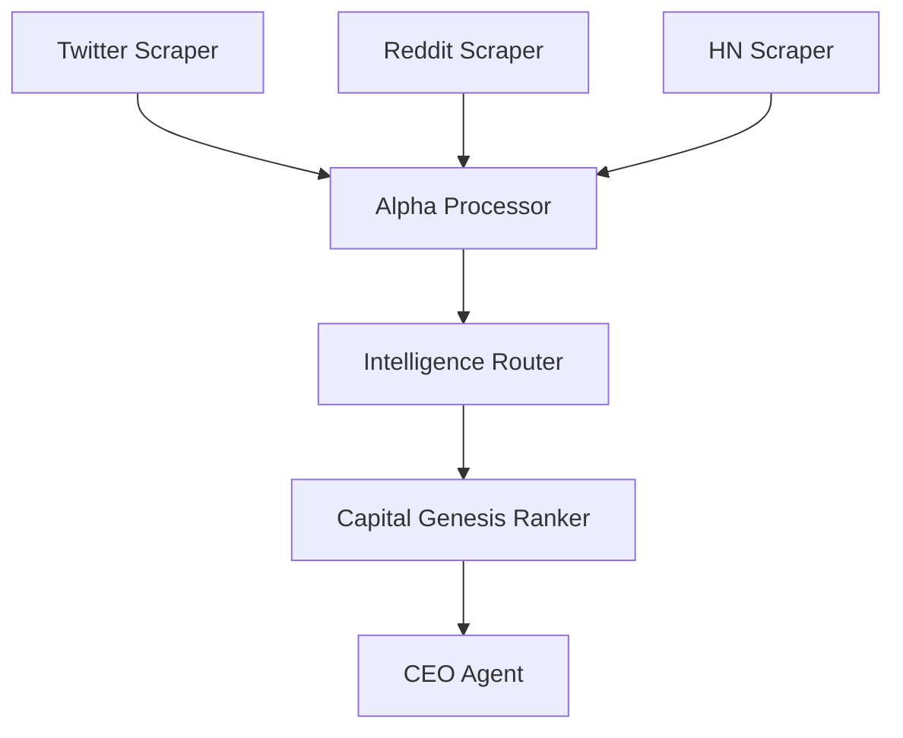

# Sovrun × Master Ops Integration Map

Generated: 2026-03-19 | Source: PRINTMAXX_MASTER_OPS_ENHANCED (181 ops, 14 sheets)

## P0 — Deploy This Week (15 ops)

| OP_ID | OP_NAME | Enhancement | Sovrun Module | New n8n Workflow? |
|---|---|---|---|---|
| N61 | Nationwide Local Biz Website Redesign | handoff chain: scraper→scorer→outreach→closer | handoff.py + workflow_bridge.py | w01 (GMaps) already built |
| D01 | Gumroad Digital Product Store | crash recovery for batch listing | durable.py | w14 (Stripe delivery) already built |
| N02 | Faceless YouTube Channel (Golf/Fishing) | DAG parallel: script gen + thumbnail gen + SEO | orchestration.py | w20 (YouTube upload) needed |
| N12 | Newsletter + Beehiiv Setup | content repurposing pipeline | workflow_bridge.py | w09 (content repurpose) already built |
| S02 | Local Biz Automation Service (EAS) | full handoff chain: lead→qualify→pitch→close→deliver | handoff.py | w01+w02 already built |
| C12 | Boomer Male 55-70 Affiliate | n8n workflow for affiliate link tracking + Facebook posting | workflow_bridge.py | NEW: w24 needed |
| S01 | Claude Code Freelance Arbitrage | procedural memory for proposal templates | procedural_memory.py | No |
| N01 | Twitter/X Content Machine | skill docs from past viral posts | procedural_memory.py | No |
| N13 | Cold Email Outreach Engine | SendGrid workflow already built | workflow_bridge.py | w04 already built |
| I05 | Reddit Pain Point Mining | n8n workflow already built | workflow_bridge.py | w13 already built |
| G01 | SEO Programmatic Pages | DAG parallel: keyword research + page gen + deploy | orchestration.py | No |
| G04 | Affiliate Link Optimization | crash recovery for batch processing | durable.py | No |
| G12 | Cross-Platform Content Distribution | content repurposing workflow | workflow_bridge.py | w09 already built |
| N68 | Ramadan Fasting Tracker PWA | already deployed, needs Stripe webhook | workflow_bridge.py | w14 already built |
| P01 | AI Persona Content Factory | parallel persona generation | orchestration.py | No |

## P1 — Deploy This Month (50 ops)

### Content (C01-C18)
| OP_ID | OP_NAME | Enhancement | Module |
|---|---|---|---|
| C01 | TikTok Content Farm | procedural memory for hook patterns | procedural_memory.py |
| C02 | YouTube Automation (Faceless) | DAG: script→voice→edit→thumbnail→upload | orchestration.py |
| C04 | Twitter Thread Factory | skill docs from high-engagement threads | procedural_memory.py |
| C05 | Newsletter Pipeline | handoff: content_gen→editor→scheduler | handoff.py |
| C08 | Viral Content Scanner | tracing for which content types convert | tracing.py |

### Services (S04-S18)
| OP_ID | OP_NAME | Enhancement | Module |
|---|---|---|---|
| S04 | Voice AI Automation (Bland.ai) | n8n workflow for call routing + CRM | workflow_bridge.py |
| S05 | Vertical SaaS Builder | crash recovery for multi-day builds | durable.py |
| S08 | Cold Outreach at Scale | handoff: lead_scrape→enrich→personalize→send→track | handoff.py |

### Digital Products (D02-D12)
| OP_ID | OP_NAME | Enhancement | Module |
|---|---|---|---|
| D02 | Whop Digital Store | sales webhook pipeline | workflow_bridge.py |
| D05 | Prompt Pack Store | procedural memory for best-selling prompt patterns | procedural_memory.py |

### Apps (A01-A04)
| OP_ID | OP_NAME | Enhancement | Module |
|---|---|---|---|
| A01 | PWA Factory | DAG: design→build→test→deploy→ASO (parallel where possible) | orchestration.py |
| A02 | Chrome Extension Factory | crash recovery for build pipeline | durable.py |

## New n8n Workflows Needed

| ID | Name | What It Does | Venture |
|---|---|---|---|
| w20 | YouTube Auto-Upload | Webhook receives generated video → uploads to YouTube via API → sets title/description/tags/thumbnail → schedules publish | C02, N02 |
| w21 | Bland.ai Call Router | Inbound call → Bland.ai answers → qualifies lead → routes to CRM → sends Telegram alert | S04, S02 |
| w22 | A/B Test Data Collector | Cron collects engagement metrics from multiple platforms → aggregates in Sheets → identifies winners → triggers scale-up workflow | G01, C01 |
| w23 | Telegram Command Center | Telegram bot receives commands → routes to appropriate PRINTMAXX agent via webhook → returns results | ALL |
| w24 | Facebook Group Poster | Cron → generates boomer-friendly content via claude -p → posts to Facebook Groups via Graph API → tracks engagement | C12 |

## Agent Handoff Chains

### Chain 1: Local Biz Pipeline (N61 + S02)
```
savvy_lead_scraper → lead_enrichment → eas_lead_pipeline → cold_email_generator → follow_up_tracker → close_tracker
```
Each step hands off context (lead data, enrichment results, email draft) to the next via handoff.py.

### Chain 2: Content Factory (C01-C12)
```
alpha_scanner → topic_selector → content_generator → voice_injector → platform_formatter → scheduler
```
Intelligence router feeds alpha → agent picks best topic → generates content → voice model ensures user's tone → formats per platform → schedules posts.

### Chain 3: Product Launch (D01-D12)
```
demand_scanner → product_builder → listing_creator → distribution_engine → sales_tracker
```
Scans for demand signals → builds digital product → creates listing on Gumroad/Whop → distributes via email/social → tracks sales via Stripe webhook.

### Chain 4: Freelance Pipeline (S01)
```
job_scanner → proposal_writer → submission_tracker → delivery_manager → review_collector → upsell_generator
```
Procedural memory injects winning proposal templates at step 2.

### Chain 5: Alpha-to-Revenue (ALL)
```
scraper_fleet → alpha_processor → intelligence_router → capital_genesis_ranker → venture_autonomy → execution_agent
```
This is the master chain. Everything feeds into it. The ranker decides priority, venture_autonomy picks the best execution path.

## DAG Candidates (Currently Sequential, Should Parallel)

### 1. Morning Intelligence Pipeline
Currently: Twitter scraper (6AM) → Reddit scraper (6:15) → Alpha processor (6:30) → Sequential
Should be: All scrapers parallel → merge results → single alpha processing pass


### 2. Content Production
Currently: Generate text → generate image → format → post → Sequential
Should be: Text + image in parallel → format → post
Saves ~40% time per content batch.

### 3. Lead Gen + Outreach
Currently: Scrape → enrich → email → Sequential
Should be: GMaps + Apollo + Reddit scrape in parallel → merge → parallel email + LinkedIn + Telegram outreach

### 4. App Factory
Currently: Design → build → test → deploy → Sequential
Should be: Design + competitor research in parallel → build → test + ASO prep in parallel → deploy

## Procedural Memory Skill Categories (P0)

| Skill Category | Source Data | Benefit |
|---|---|---|
| proposal_writing | Past freelance proposals (S01 wins/losses) | 3x faster proposals with proven templates |
| cold_email_personalization | Past email campaigns (open rates, replies) | Higher response rates from patterns that worked |
| content_hook_patterns | Past viral content (engagement metrics) | Reuse hooks that got >1K engagement |
| app_listing_copy | Past ASO results (download rates) | Better app store descriptions from proven patterns |
| client_objection_handling | Past EAS sales conversations | Pre-built responses to common objections |

## Conflict Avoidance Rules

These existing systems must NOT be disrupted:
1. **Cron schedule** — don't overlap new crons with existing 112 entries
2. **CEO checkpoint** — DAG orchestration complements, doesn't replace CycleCheckpoint
3. **Resilience layer** — new modules import from resilience.py, don't reinvent
4. **Twitter warmup** — Day 2 of 21-day ramp, don't touch posting cadence
5. **Loop closer** — new skill capture hooks INTO loop_closer, doesn't replace it
6. **Intelligence router** — new workflows CONSUME router output, don't bypass it
7. **Control panel** — ONE dashboard rule still applies (localhost:9999)

## Tool Integration Decision Log (2026-03-19)

### SKIP (we already have better versions)
| Tool | Our Version | Why Skip |
|---|---|---|
| MoneyPrinterTurbo | auto_clip_pipeline.py + ai_video_content_pipeline.py | Ours has affiliate hooks, voice model injection, PRINTMAXXER copy style |
| ShortGPT | auto_clip_pipeline.py | Ours uses Claude for viral moment detection, theirs uses GPT |
| yt-dlp | Already installed, used in clip pipeline | Already integrated |

### WIRE IN (adds genuine value)
| Tool | What It Adds | Which Ventures |
|---|---|---|
| Postiz | 30+ platform scheduling (we only have Twitter + manual) | C01-C18 content ventures |
| Crawl4AI | LLM-friendly web crawling (cleaner than our custom scrapers for generic URLs) | Intelligence pipeline, alpha scraping |
| Polar | Self-hosted payment platform (replaces Gumroad dependency, better margins) | D01-D12 digital products |
| Freqtrade | Crypto trading backtesting (new capability) | I01-I05 investment ventures |
| listmonk | Self-hosted newsletter (replaces Beehiiv dependency) | N12 newsletter, C05 pipeline |
| Google Stitch | UI generation via browser control (when API available) | App factory, landing pages |

### HYBRID (combine best of both)
| Tool | Our Version | Hybrid Approach |
|---|---|---|
| Mautic | eas_lead_pipeline.py | Use Mautic CRM for EAS clients, our pipeline for PRINTMAXX internal leads |
| Crawl4AI + our scrapers | Platform-specific scrapers (Twitter, Reddit) | Use our scrapers for authenticated/platform-specific, Crawl4AI for generic web crawling |
